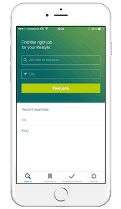

# Input-Framer

Framer module to easily turn your designs inputs into real inputs.



## Add it in your Framer Studio project

- Download the project from github.
- Copy `input.coffee` and `keyboard.png` into `modules/` folder.
- Import it in Framer Studio by writing: `InputModule = require "input"`.

**Note:** `keyboard.png` is prepared for iPhone 6. If you want to use a different size, replace with your own image.

## How to use it

Export your assets as you would do normally, then create an input object and place it over your designed input. Done!  
Remember that all parameters are optional.

```coffeescript
input = new InputModule.Input
	setup: false # Change to true when positioning the input so you can see it
	virtualKeyboard: true # Enable or disable virtual keyboard for when viewing on computer
	text: "Some text" # Remove this if you don't want to have text initially
	placeholder: "Username"
	placeholderColor: "#fff"
	type: "text" # Use any of the available HTML input types. Take into account that on the computer the same keyboard image will appear regarding the type used.
	y: 240
	x: 90
	width: 500
	height: 60
	goButton: false # Set true here in order to use "Go" instead of "Return" as button (only works on real devices)
```

#### Styling your input

```coffeescript
input.style = 
	fontSize: "30px"
	lineHeight: "30px"
	padding: "10px"
	color: "white"
	...
```

#### Retrieving value of your input

You can access directly to `.value` property to get the value. For example to get the value on each key up you could do something like this...

```coffeescript
input.on "keyup", ->
	print @value
```

#### Focusing the input via code

Imagine that you want to focus the input once you click "myButton", here is an example:

```coffeescript
myButton.on Events.Click, ->
	input.focus()
```

### [Advanced] Accessing original elements

The input layer is constructed of a form and an input field. You can always access those elements by accessing directly to the properties `input` and `form`.

Example:

```coffeescript
someNiceInput.form.addEventListener "submit", ->
	print "The form was submitted"
someNiceInput.input.something...
```
